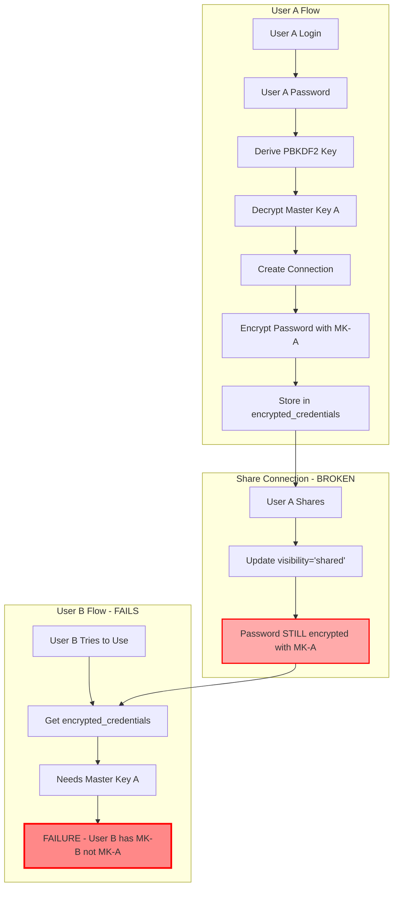
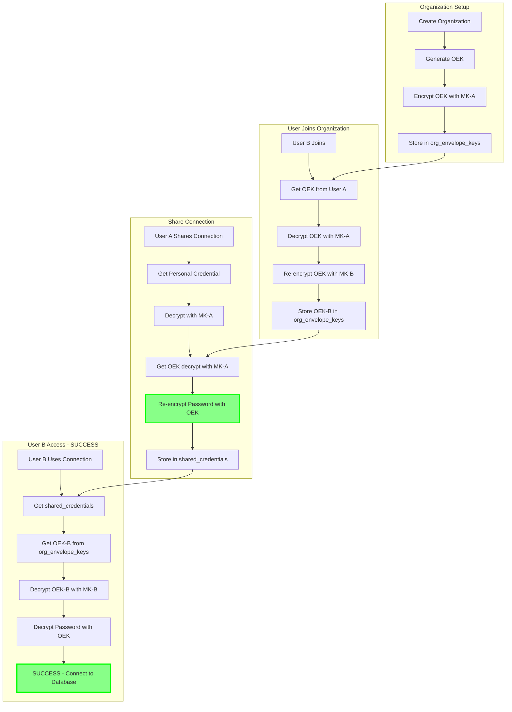

# Credential Sharing Architecture - Visual Diagrams

## 1. Current Broken Architecture



## 2. New Architecture - Envelope Encryption



## 3. Encryption Layers Visualization

```
┌────────────────────────────────────────────────────────────────┐
│                         CLIENT SIDE                             │
├────────────────────────────────────────────────────────────────┤
│                                                                 │
│  1. User enters password: "myP@ssw0rd"                         │
│     └─ Visible only in browser memory, never sent to server   │
│                                                                 │
│  2. Derive PBKDF2 key (600k iterations):                       │
│     PBKDF2("myP@ssw0rd", salt) → KEK (Key Encryption Key)      │
│                                                                 │
│  3. Decrypt Master Key:                                        │
│     AES-GCM-Decrypt(encrypted_MK, KEK) → Master Key (32 bytes) │
│                                                                 │
└────────────────────────────────────────────────────────────────┘
                               ▼
┌────────────────────────────────────────────────────────────────┐
│                      CREDENTIAL FLOW                            │
├────────────────────────────────────────────────────────────────┤
│                                                                 │
│  PERSONAL CONNECTION:                                           │
│  ┌──────────────────────────────────────────────────┐         │
│  │ DB Password: "postgres123"                        │         │
│  │   └─ AES-GCM-Encrypt with Master Key              │         │
│  │      └─ Store in encrypted_credentials table      │         │
│  └──────────────────────────────────────────────────┘         │
│                                                                 │
│  SHARED CONNECTION:                                             │
│  ┌──────────────────────────────────────────────────┐         │
│  │ DB Password: "postgres123"                        │         │
│  │   └─ LAYER 1: Encrypt with Org Envelope Key (OEK)│         │
│  │      └─ Store in shared_credentials               │         │
│  │                                                    │         │
│  │ Org Envelope Key (32 bytes random)                │         │
│  │   └─ LAYER 2: Encrypt OEK with User A's MK → OEK-A         │
│  │   └─ LAYER 2: Encrypt OEK with User B's MK → OEK-B         │
│  │      └─ Store in org_envelope_keys                │         │
│  └──────────────────────────────────────────────────┘         │
│                                                                 │
└────────────────────────────────────────────────────────────────┘
                               ▼
┌────────────────────────────────────────────────────────────────┐
│                       SERVER DATABASE                           │
├────────────────────────────────────────────────────────────────┤
│                                                                 │
│  user_master_keys:                                              │
│  ┌────────────┬──────────────────────────────────────┐        │
│  │ user_id    │ encrypted_master_key (Base64)        │        │
│  ├────────────┼──────────────────────────────────────┤        │
│  │ user-A     │ xJ8kL2mN...  (encrypted with PBKDF2) │        │
│  │ user-B     │ pQ9rS7tV...  (encrypted with PBKDF2) │        │
│  └────────────┴──────────────────────────────────────┘        │
│                                                                 │
│  organization_envelope_keys:                                    │
│  ┌────────────┬────────────┬───────────────────────┐          │
│  │ org_id     │ user_id    │ encrypted_oek         │          │
│  ├────────────┼────────────┼───────────────────────┤          │
│  │ org-123    │ user-A     │ a7B8c9D...  (MK-A)    │          │
│  │ org-123    │ user-B     │ e1F2g3H...  (MK-B)    │          │
│  │ org-123    │ user-C     │ i4J5k6L...  (MK-C)    │          │
│  └────────────┴────────────┴───────────────────────┘          │
│                                                                 │
│  shared_credentials:                                            │
│  ┌───────────────┬────────────┬──────────────────────┐        │
│  │ connection_id │ org_id     │ encrypted_password    │        │
│  ├───────────────┼────────────┼──────────────────────┤        │
│  │ conn-xyz      │ org-123    │ m7N8o9P...  (OEK)    │        │
│  │ conn-abc      │ org-123    │ q1R2s3T...  (OEK)    │        │
│  └───────────────┴────────────┴──────────────────────┘        │
│                                                                 │
│  encrypted_credentials (personal only):                         │
│  ┌──────────┬───────────────┬──────────────────────┐          │
│  │ user_id  │ connection_id │ encrypted_password    │          │
│  ├──────────┼───────────────┼──────────────────────┤          │
│  │ user-A   │ conn-personal │ u4V5w6X...  (MK-A)   │          │
│  └──────────┴───────────────┴──────────────────────┘          │
│                                                                 │
└────────────────────────────────────────────────────────────────┘
```

## 4. Access Control Matrix

```
┌─────────────────────────────────────────────────────────────────┐
│             Personal vs Shared Connection Access                 │
├─────────────────────────────────────────────────────────────────┤
│                                                                  │
│  PERSONAL CONNECTION (conn-personal):                            │
│                                                                  │
│    User A (creator)   ✓ Can Read/Update/Delete                  │
│    User B (org member) ✗ No Access                              │
│    User C (org member) ✗ No Access                              │
│                                                                  │
│    Stored in: encrypted_credentials (user-A, conn-personal)     │
│    Encrypted with: User A's Master Key                          │
│                                                                  │
├─────────────────────────────────────────────────────────────────┤
│                                                                  │
│  SHARED CONNECTION (conn-shared):                                │
│                                                                  │
│    User A (creator/owner) ✓ Can Read/Update/Delete/Unshare     │
│    User B (org admin)     ✓ Can Read/Update/Delete              │
│    User C (org member)    ✓ Can Read                            │
│    User D (different org) ✗ No Access                           │
│                                                                  │
│    Stored in: shared_credentials (conn-shared, org-123)         │
│    Encrypted with: Organization Envelope Key                     │
│    OEK copies: org_envelope_keys (org-123, user-A/B/C)          │
│                                                                  │
└─────────────────────────────────────────────────────────────────┘
```

## 5. Member Lifecycle Flows

### A. New Member Joins Organization

```
┌──────────────┐
│ Admin invites│
│   User D     │
└──────┬───────┘
       │
       ▼
┌─────────────────────────────────────────┐
│ 1. User D accepts invitation             │
└──────┬──────────────────────────────────┘
       │
       ▼
┌─────────────────────────────────────────┐
│ 2. Server needs to give User D access   │
│    to org's shared credentials          │
└──────┬──────────────────────────────────┘
       │
       ▼
┌─────────────────────────────────────────┐
│ 3. Get OEK from existing member (Admin) │
│    - Get Admin's encrypted OEK           │
│    - Decrypt with Admin's Master Key     │
│    - Now have plaintext OEK              │
└──────┬──────────────────────────────────┘
       │
       ▼
┌─────────────────────────────────────────┐
│ 4. Encrypt OEK for User D               │
│    - Get User D's Master Key             │
│    - Encrypt OEK with MK-D               │
│    - Store as org_envelope_keys record   │
└──────┬──────────────────────────────────┘
       │
       ▼
┌─────────────────────────────────────────┐
│ 5. User D can now decrypt all shared    │
│    credentials using their copy of OEK  │
└─────────────────────────────────────────┘

Result: User D has access to all shared connections instantly
Storage: Added 1 row to org_envelope_keys
Crypto operations: 2 (decrypt OEK, encrypt OEK)
```

### B. Member Leaves Organization

```
┌──────────────┐
│ Admin removes│
│   User B     │
└──────┬───────┘
       │
       ▼
┌─────────────────────────────────────────┐
│ 1. Delete User B's OEK record           │
│    DELETE FROM org_envelope_keys        │
│    WHERE org_id='org-123'               │
│      AND user_id='user-B'               │
└──────┬──────────────────────────────────┘
       │
       ▼
┌─────────────────────────────────────────┐
│ 2. Remove from organization members     │
│    DELETE FROM organization_members     │
│    WHERE org_id='org-123'               │
│      AND user_id='user-B'               │
└──────┬──────────────────────────────────┘
       │
       ▼
┌─────────────────────────────────────────┐
│ 3. User B can no longer decrypt shared  │
│    credentials (no OEK → can't decrypt) │
└─────────────────────────────────────────┘

Result: User B immediately loses access
Storage: Deleted 1 row from org_envelope_keys
Crypto operations: 0 (no re-encryption needed!)
Other members: Unaffected (still have their OEK copies)
```

### C. Connection Sharing Flow

```
Personal Connection        Share Action          Shared Connection
┌─────────────────┐                            ┌──────────────────┐
│ encrypted_creds │                            │ shared_creds     │
│                 │                            │                  │
│ user: user-A    │──┐                    ┌──▶│ org: org-123     │
│ conn: conn-xyz  │  │                    │   │ conn: conn-xyz   │
│ pass: [MK-A]    │  │                    │   │ pass: [OEK]      │
└─────────────────┘  │                    │   └──────────────────┘
                     │                    │
                     │  ┌──────────────┐  │
                     └─▶│ 1. Decrypt   │──┘
                        │    with MK-A │
                        ├──────────────┤
                        │ 2. Get OEK   │
                        ├──────────────┤
                        │ 3. Re-encrypt│
                        │    with OEK  │
                        └──────────────┘

Timeline:
T0: Connection is personal (only User A can decrypt)
T1: ShareConnection() called
T2: Password re-encrypted with OEK
T3: Stored in shared_credentials
T4: Connection is shared (all org members can decrypt)
```

## 6. Security Boundaries

```
┌───────────────────────────────────────────────────────────────┐
│                        TRUST BOUNDARIES                        │
├───────────────────────────────────────────────────────────────┤
│                                                                │
│  CLIENT (User's Browser)                                       │
│  ┌─────────────────────────────────────────────────────────┐ │
│  │ TRUSTED ZONE                                             │ │
│  │ - User's password (plaintext)                            │ │
│  │ - Decrypted master key (plaintext)                       │ │
│  │ - Decrypted OEK (plaintext)                              │ │
│  │ - Decrypted DB passwords (plaintext)                     │ │
│  │                                                           │ │
│  │ Security: Memory only, never logged, cleared on logout   │ │
│  └─────────────────────────────────────────────────────────┘ │
│                              │                                 │
│                              │ TLS/HTTPS                       │
│                              ▼                                 │
│  ┌─────────────────────────────────────────────────────────┐ │
│  │ ENCRYPTED CHANNEL                                        │ │
│  │ - Encrypted payloads only                                │ │
│  │ - Session tokens                                         │ │
│  │ - Never plaintext passwords                              │ │
│  └─────────────────────────────────────────────────────────┘ │
│                              │                                 │
│                              ▼                                 │
│  SERVER (Backend API)                                          │
│  ┌─────────────────────────────────────────────────────────┐ │
│  │ UNTRUSTED ZONE (Zero-Knowledge)                          │ │
│  │ - Receives encrypted master keys                         │ │
│  │ - Receives encrypted OEKs                                │ │
│  │ - Receives encrypted passwords                           │ │
│  │ - Performs operations on ciphertext                      │ │
│  │ - Returns ciphertext to client                           │ │
│  │                                                           │ │
│  │ Security: No plaintext secrets, audit all access         │ │
│  └─────────────────────────────────────────────────────────┘ │
│                              │                                 │
│                              ▼                                 │
│  DATABASE (Turso)                                              │
│  ┌─────────────────────────────────────────────────────────┐ │
│  │ PERSISTENT STORAGE (Zero-Knowledge)                      │ │
│  │ - Encrypted master keys                                  │ │
│  │ - Encrypted OEKs                                         │ │
│  │ - Encrypted passwords                                    │ │
│  │ - Metadata (non-sensitive)                               │ │
│  │                                                           │ │
│  │ Security: Encrypted at rest, no plaintext secrets        │ │
│  └─────────────────────────────────────────────────────────┘ │
│                                                                │
└───────────────────────────────────────────────────────────────┘

Attack Scenarios:
✓ Database breach → All data encrypted, attacker gets ciphertext only
✓ Server compromise → No plaintext secrets in memory/logs
✓ Network sniffing → TLS encrypts all traffic
✗ Client compromise → Attacker has plaintext (but only for that user)
✓ Malicious admin → Audit logs track all credential access
```

## 7. Performance Comparison

```
┌────────────────────────────────────────────────────────────────┐
│          Storage Requirements: Envelope vs Re-Encrypt          │
├────────────────────────────────────────────────────────────────┤

   Organization: 50 members, 20 shared connections

   ENVELOPE APPROACH (Current Design):
   ┌──────────────────────────────────────┐
   │ org_envelope_keys:     50 records    │  (one per member)
   │ shared_credentials:    20 records    │  (one per connection)
   │ ─────────────────────────────────────│
   │ TOTAL:                 70 records    │
   └──────────────────────────────────────┘

   RE-ENCRYPT APPROACH (Alternative):
   ┌──────────────────────────────────────┐
   │ shared_credentials:  1,000 records   │  (50 × 20)
   │ ─────────────────────────────────────│
   │ TOTAL:              1,000 records    │
   └──────────────────────────────────────┘

   Ratio: 14.3x more storage for re-encrypt approach

├────────────────────────────────────────────────────────────────┤

   OPERATION COMPLEXITY:

   Decrypt shared password:
   - Envelope:    O(1) - 3 queries (fixed)
   - Re-encrypt:  O(1) - 1 query
   - Winner: Re-encrypt (slightly faster)

   Share connection:
   - Envelope:    O(1) - Re-encrypt once with OEK
   - Re-encrypt:  O(N) - Re-encrypt for each member
   - Winner: Envelope (scales to large orgs)

   Add new member:
   - Envelope:    O(1) - Encrypt OEK for new member
   - Re-encrypt:  O(M) - Re-encrypt all M connections
   - Winner: Envelope (instant onboarding)

   Remove member:
   - Envelope:    O(1) - Delete OEK record
   - Re-encrypt:  O(1) - Delete member's records
   - Winner: Tie

├────────────────────────────────────────────────────────────────┤

   SCALABILITY SIMULATION (1000 members, 100 connections):

   Storage:
   - Envelope:     1,100 records
   - Re-encrypt: 100,000 records (91x more)

   New member onboarding time:
   - Envelope:    ~50ms  (encrypt 1 OEK)
   - Re-encrypt:  ~5000ms (re-encrypt 100 credentials)
   - Winner: Envelope (100x faster)

└────────────────────────────────────────────────────────────────┘
```

## 8. Migration Visualization

```
BEFORE MIGRATION:                    AFTER MIGRATION:

connection_templates                 connection_templates
┌──────────────────┐                ┌──────────────────────────┐
│ id: conn-shared  │                │ id: conn-shared          │
│ visibility: shared│               │ visibility: shared       │
│ org_id: org-123  │                │ org_id: org-123          │
│                  │                │ encryption_type: shared  │ ← NEW
└──────────────────┘                └──────────────────────────┘

encrypted_credentials                encrypted_credentials
┌──────────────────┐                ┌──────────────────────────┐
│ user: user-A     │                │ user: user-A             │
│ conn: conn-shared│                │ conn: conn-personal      │
│ pass: [MK-A]     │                │ pass: [MK-A]             │
│                  │                │ (only personal now)      │
└──────────────────┘                └──────────────────────────┘
                                                 │
                                                 ▼
                                    NEW TABLES ADDED:

                                    organization_envelope_keys
                                    ┌──────────────────────────┐
                                    │ org: org-123             │
                                    │ user: user-A             │
                                    │ encrypted_oek: [MK-A]    │
                                    ├──────────────────────────┤
                                    │ org: org-123             │
                                    │ user: user-B             │
                                    │ encrypted_oek: [MK-B]    │
                                    └──────────────────────────┘

                                    shared_credentials
                                    ┌──────────────────────────┐
                                    │ conn: conn-shared        │
                                    │ org: org-123             │
                                    │ pass: [OEK]              │
                                    └──────────────────────────┘

Migration Steps:
1. Create new tables (zero downtime)
2. Deploy new code (backward compatible)
3. Run migration script:
   - For each shared connection
   - Decrypt with creator's MK
   - Re-encrypt with org OEK
   - Store in shared_credentials
4. Update encryption_type field
5. Verify all shared connections work
6. Optional: Clean up old encrypted_credentials for shared conns
```

## 9. API Flow Sequence Diagram

```
User B wants to use User A's shared connection:

Client (User B)          Backend API           Database
     │                       │                      │
     │ GET /connections      │                      │
     │─────────────────────▶│                      │
     │                       │ Query shared conns   │
     │                       │─────────────────────▶│
     │                       │◁─────────────────────│
     │◁─────────────────────│ [{conn-xyz, shared}] │
     │                       │                      │
     │ GET /connections/     │                      │
     │     conn-xyz/password │                      │
     │─────────────────────▶│                      │
     │                       │                      │
     │                       │ 1. Verify membership │
     │                       │─────────────────────▶│
     │                       │ (org_members)        │
     │                       │◁─────────────────────│
     │                       │                      │
     │                       │ 2. Get shared cred   │
     │                       │─────────────────────▶│
     │                       │ (shared_credentials) │
     │                       │◁─────────────────────│
     │                       │ encrypted_pass [OEK] │
     │                       │                      │
     │                       │ 3. Get User B's OEK  │
     │                       │─────────────────────▶│
     │                       │ (org_envelope_keys)  │
     │                       │◁─────────────────────│
     │                       │ encrypted_oek [MK-B] │
     │                       │                      │
     │                       │ 4. Get User B's MK   │
     │                       │─────────────────────▶│
     │                       │ (user_master_keys)   │
     │                       │◁─────────────────────│
     │                       │ encrypted_mk [PBKDF2]│
     │                       │                      │
     │◁─────────────────────│ Return encrypted     │
     │  All encrypted data   │ bundle to client     │
     │                       │                      │
     │ [CLIENT-SIDE ONLY]    │                      │
     │ 1. Derive PBKDF2 key  │                      │
     │ 2. Decrypt MK-B       │                      │
     │ 3. Decrypt OEK        │                      │
     │ 4. Decrypt password   │                      │
     │ 5. Connect to DB      │                      │
     │                       │                      │
     │ POST /audit-log       │                      │
     │─────────────────────▶│                      │
     │ (access successful)   │ Log to              │
     │                       │ credential_access_log│
     │                       │─────────────────────▶│
     │◁─────────────────────│                      │
     │ 200 OK                │                      │
     │                       │                      │
```

## 10. Threat Model

```
┌──────────────────────────────────────────────────────────────┐
│                         THREAT ANALYSIS                       │
├──────────────────────────────────────────────────────────────┤

Threat 1: Database Breach
├─ Attack: Hacker gains full database access
├─ Impact: High (all data visible)
├─ Mitigation:
│  ✓ All passwords encrypted with user/org keys
│  ✓ Master keys encrypted with PBKDF2-derived keys
│  ✓ No plaintext secrets in database
│  ✓ Attacker needs user passwords to decrypt
└─ Risk: LOW (encryption protects data at rest)

Threat 2: Server Compromise
├─ Attack: Hacker compromises backend server
├─ Impact: High (can modify code)
├─ Mitigation:
│  ✓ Zero-knowledge: server never sees plaintext
│  ✓ All decryption happens client-side
│  ✓ Audit logs track all access
│  ✓ Rate limiting prevents mass extraction
└─ Risk: MEDIUM (depends on attacker access level)

Threat 3: Malicious Org Member
├─ Attack: Member exports all shared credentials
├─ Impact: Medium (org data only)
├─ Mitigation:
│  ✓ Audit logs track all decryptions
│  ✓ Rate limiting prevents mass export
│  ✓ Per-connection access controls possible
│  ✓ Immediate revocation on removal
└─ Risk: MEDIUM (inherent in sharing model)

Threat 4: Credential Stuffing / Brute Force
├─ Attack: Attacker tries common passwords
├─ Impact: High (account takeover)
├─ Mitigation:
│  ✓ PBKDF2 600k iterations (slow)
│  ✓ Rate limiting on login
│  ✓ 2FA recommended
│  ✓ Login attempt tracking
└─ Risk: LOW (PBKDF2 makes brute force impractical)

Threat 5: Insider Threat (Org Admin)
├─ Attack: Admin abuses access to shared credentials
├─ Impact: Medium (can access shared DBs)
├─ Mitigation:
│  ✓ Complete audit trail
│  ✓ Alerting on suspicious access patterns
│  ✓ Per-connection permissions possible
│  ✗ Cannot prevent (admin has legitimate access)
└─ Risk: MEDIUM (feature, not bug - admins need access)

Threat 6: Man-in-the-Middle
├─ Attack: Intercept network traffic
├─ Impact: High (credential theft)
├─ Mitigation:
│  ✓ TLS encryption for all API calls
│  ✓ Certificate pinning possible
│  ✓ Encrypted payloads even in transit
└─ Risk: LOW (TLS protects in transit)

Threat 7: Key Rotation Failure
├─ Attack: Compromised OEK not rotated
├─ Impact: High (continued access)
├─ Mitigation:
│  ✓ Key rotation procedure implemented
│  ✓ Audit when last rotation occurred
│  ✓ Automated rotation policies possible
└─ Risk: LOW (operational concern)

Threat 8: Shared Credential Persistence
├─ Attack: Removed member cached credentials
├─ Impact: Medium (temporary access)
├─ Mitigation:
│  ✓ Server-side revocation (delete OEK)
│  ✓ Client-side session invalidation
│  ✗ Cannot prevent local caching
└─ Risk: MEDIUM (time-limited exposure)

└──────────────────────────────────────────────────────────────┘

Overall Risk Level: LOW-MEDIUM
Recommendation: Deploy with monitoring and audit logging
```

---

## Summary

This design provides:

1. **Zero-Knowledge Security**: Server never sees plaintext passwords
2. **Scalability**: O(N+M) storage, O(1) most operations
3. **Instant Revocation**: Delete OEK record = instant access loss
4. **Auditability**: Complete trail of all credential access
5. **Backward Compatibility**: Personal credentials unchanged

The envelope key approach balances security, performance, and usability for multi-tenant credential sharing.
